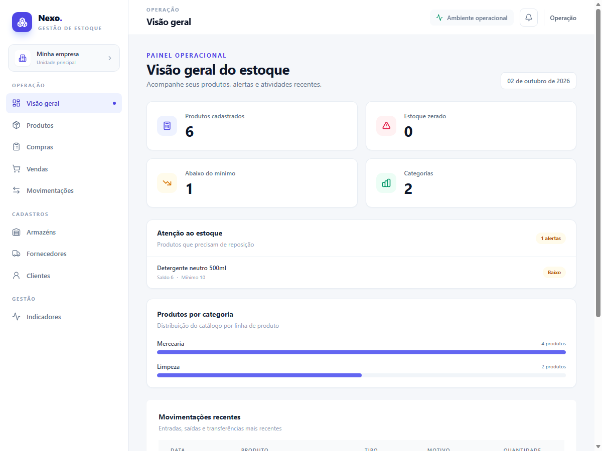
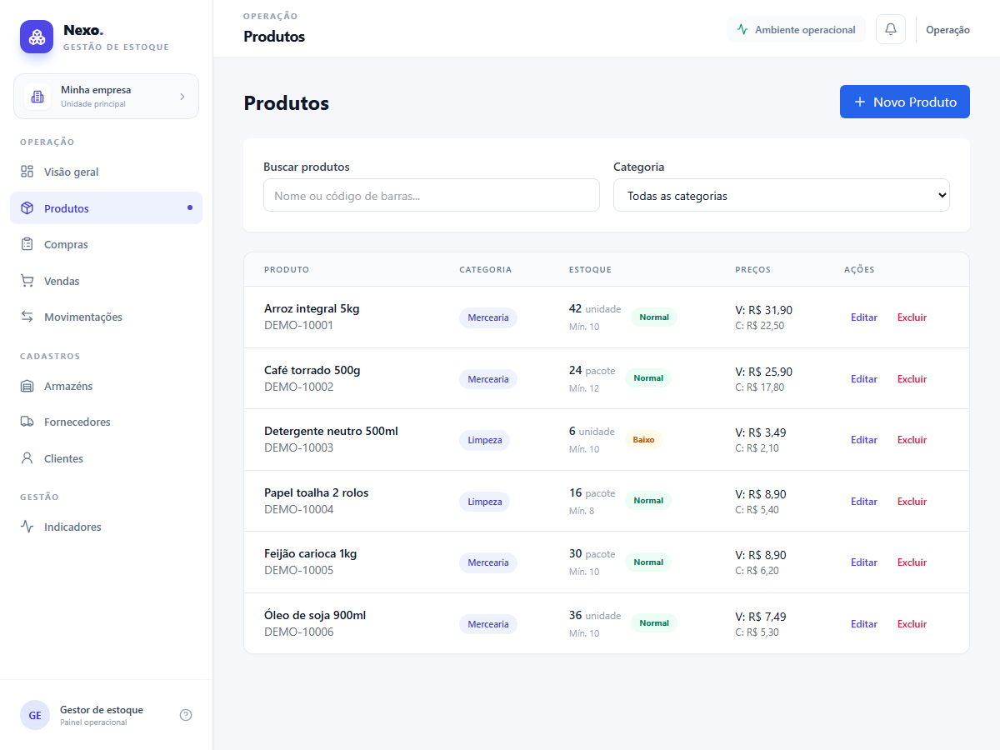

# Nexo Gestão: operações de uma pequena distribuidora

Um ERP operacional para uma pequena distribuidora. O sistema conecta cadastro de produtos, fornecedores, compras, recebimento, saldo por depósito, clientes, pedidos de venda e expedição em um mesmo fluxo. Cada movimento de estoque tem uma origem compreensível: uma compra recebida, uma venda expedida ou uma transferência entre depósitos.



## Fluxo de trabalho

1. Cadastre fornecedores, produtos, clientes e depósitos.
2. Abra um pedido de compra com os itens e o depósito de destino.
3. Registre o recebimento. O saldo do depósito e o saldo global aumentam, e o movimento fica vinculado ao pedido e ao fornecedor.
4. Abra um pedido de venda para um cliente e escolha de qual depósito separar.
5. Expedir valida o saldo local e global antes de baixar o estoque. O movimento fica ligado ao pedido e ao cliente.
6. Use transferências para mover itens entre depósitos sem alterar o saldo global.

O painel acompanha valor do estoque, alertas de reposição, depósitos e atividade recente. A análise ABC ajuda a priorizar itens por valor em estoque. Produtos são desativados, em vez de apagados, para preservar o histórico.

O escopo é de operação de uma pequena distribuidora. Financeiro, emissão fiscal, autenticação e permissões por usuário são etapas futuras, pois precisam de regras próprias antes de se tornarem confiáveis. Mais contexto em [`docs/CONTEXTO_ERP.md`](docs/CONTEXTO_ERP.md).



## Tecnologias

| Camada | Uso |
|---|---|
| Backend | Python, FastAPI, Pydantic, Motor (MongoDB assíncrono) |
| Frontend | React, Tailwind CSS, componentes shadcn/ui, Axios |
| Banco | MongoDB, ou banco em memória para demonstração (`MONGO_URL=memory`) |
| Testes | pytest + TestClient (unitários) e `backend_test.py` (19 verificações de ponta a ponta) |

## Como rodar

**Backend** (porta 8001):

```bash
python -m venv .venv
.venv/Scripts/activate        # Windows  |  source .venv/bin/activate no Linux/Mac
pip install -r backend/requirements.txt
cd backend
# Com MongoDB instalado: MONGO_URL=mongodb://localhost:27017
# Sem MongoDB (dados somem ao reiniciar):
MONGO_URL=memory uvicorn server:app --port 8001
```

**Frontend** (porta 3000):

```bash
cd frontend
yarn install
REACT_APP_BACKEND_URL=http://127.0.0.1:8001 yarn start
```

## Modo demonstração (sem servidor)

`REACT_APP_DEMO=1` troca as chamadas da API por uma versão que roda no navegador (`frontend/src/demoApi.js`). Ela inclui fornecedores e clientes, depósitos, transferências, pedidos de compra e venda, recebimento e expedição. Os dados ficam no `localStorage` de quem testa. Para gerar o pacote estático para hospedagem:

```bash
cd frontend
REACT_APP_DEMO=1 PUBLIC_URL=. yarn build
```

## Testes

```bash
pytest -q                      # testes automáticos da API (sem precisar de MongoDB)
python backend_test.py         # roteiro de ponta a ponta contra o backend rodando
```

## Histórico de correções

- O alerta de **estoque baixo nunca disparava**: o filtro comparava a quantidade com o texto `"$quantidade_minima"` em vez do campo. Corrigido com `$expr` e coberto por teste.
- Removidos o rastreador de analytics de terceiros e o selo da ferramenta que gerou o projeto.
- Painel passou a mostrar o nome do produto em cada movimentação; preços em formato brasileiro (R$ 59,90).
- Banco em memória para rodar e testar sem instalar o MongoDB; dependências reduzidas ao que o código usa.

Os módulos podem ser abertos diretamente com links como `/?page=compras`, `/?page=vendas` e `/?page=produtos`. Ao navegar, a URL acompanha a tela atual.

Código-fonte: [CauaCaetano/App-Controle-de-Estoque](https://github.com/CauaCaetano/App-Controle-de-Estoque).
